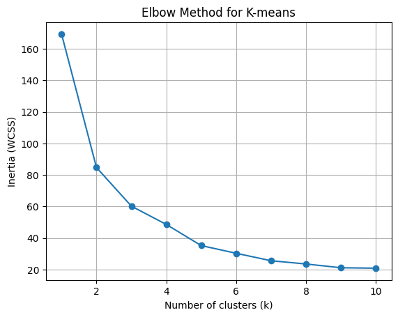
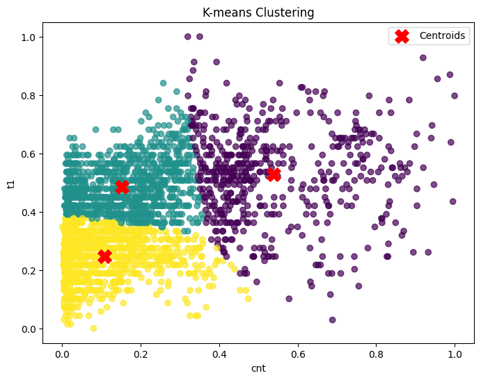
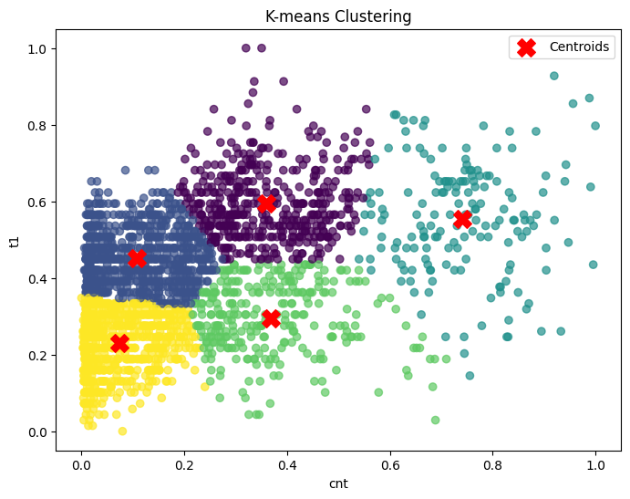
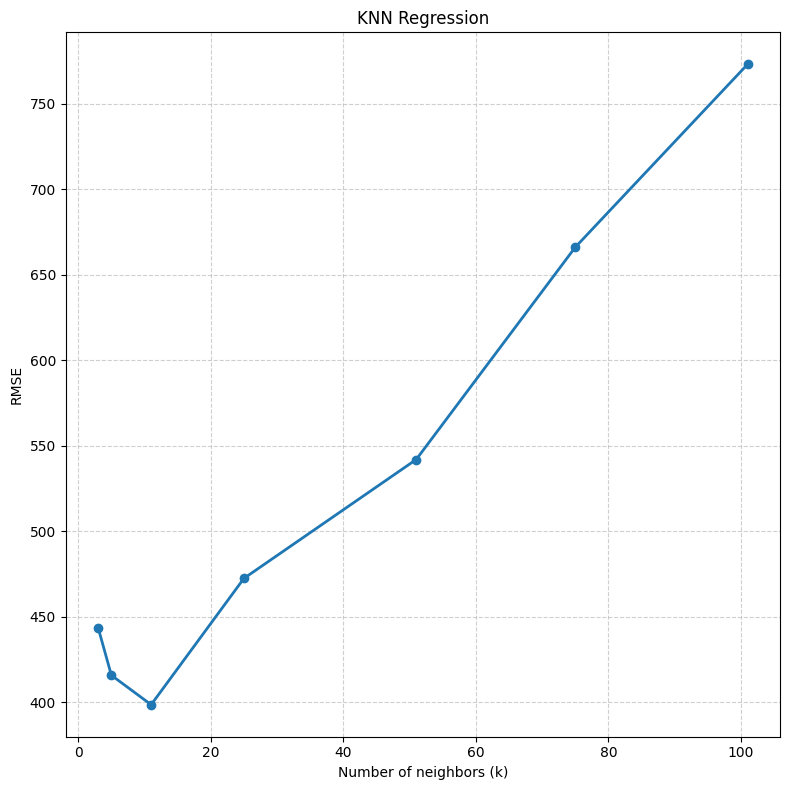
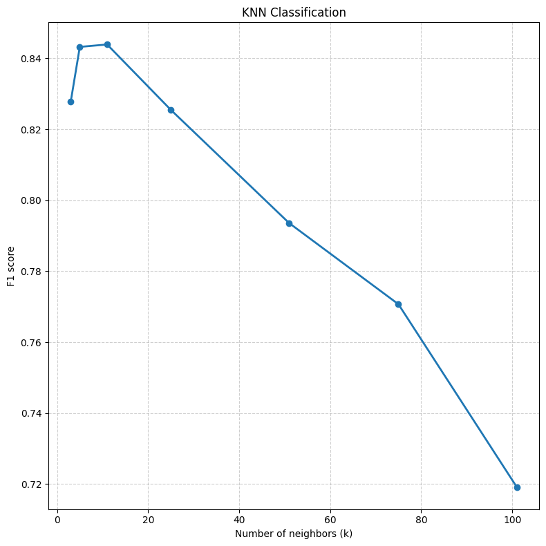

# Bike Demand Prediction with Custom KNN and Clustering

## Project Overview

This project focuses on predicting bike demand using both regression and classification approaches.

- Regression is used to estimate the exact demand
- Classification is used to categorize demand into levels (low, medium, high)

The main goal of this project was not only to build models, but to deeply understand how machine learning algorithms work and how feature choices affect performance.

---

## Implementations

The core algorithms were implemented **from scratch**:

- K-Nearest Neighbors (KNN) for:
  - Regression
  - Classification
- K-Means clustering

Additionally:
- Feature scaling and preprocessing were implemented manually
- Distance calculations were optimized using vectorized operations (NumPy)

---

## Validation

To ensure correctness and reliability, all results were compared with **scikit-learn implementations**:

- `KNeighborsRegressor`
- `KNeighborsClassifier`

This allowed:
- verifying correctness of the custom implementation
- comparing performance
- aligning the project with real-world ML workflows

---

## Feature Engineering

A major part of the project was experimenting with different feature sets and understanding their impact.

### Key features:
- Hour of the day
- Weekend / holiday indicator
- Temperature (`t1`)
- Weather conditions (`weather_code`)

### Cyclical encoding

Time-based features were transformed using sine and cosine:

- `hour_sin`, `hour_cos`
- `season_sin`, `season_cos`

This ensures that cyclic relationships are preserved.  
For example:
- 23:00 and 01:00 are close in time
- Winter and Spring are closer than Winter and Summer

---

## Results & Insights

- Model performance is highly sensitive to feature selection
- Different feature sets perform best for different tasks:
  - Classification works better with `t1` and `weather_code`
  - Regression benefits more from seasonal features (`sin/cos`)
- The optimal number of neighbors (`k`) was selected using cross-validation
- Extensive experimentation was required to identify meaningful features

---

## Visualization & Analysis

Several visualizations were used to better understand model behavior and data patterns.

### Elbow Method (K-Means)

The elbow plot was used to determine the optimal number of clusters.



The elbow plot shows a sharp decrease in inertia between k=1 and k=3, indicating that adding clusters in this range significantly improves the model.

After k≈4–5, the rate of improvement slows down, and additional clusters provide only marginal benefit.

This suggests that a reasonable number of clusters is between 3 and 5, balancing model simplicity and clustering quality.

---

### Clustering Visualization

Clusters were visualized for different values of k:




These plots help identify how data points are grouped and whether clusters are meaningful.

---

### Model Performance

Cross-validation results were visualized to compare performance across different values of k.




These plots show how model performance changes with k and help select the optimal number of neighbors.

---

## Interpretation

- The elbow method suggests a reasonable number of clusters where improvement slows down
- Model performance varies significantly with k, confirming the importance of hyperparameter selection
- Different feature sets influence clustering and prediction results in different ways

## What I Learned

This project went beyond simple implementation.

Key takeaways:
- Understanding algorithms requires implementing them from scratch
- Feature engineering can have a larger impact than the model itself
- Vectorization (NumPy) is essential for efficient computation
- Real-world ML involves experimentation, not just applying formulas

---

## Project Structure

```
project/
│
├── main.py
├── data.py
├── knn.py
├── clustering.py
├── evaluation.py
├── validation.py
│
├── data/
├── outputs/
│
├── README.md
└── requirements.txt
```
---

## How to Run

1. Install dependencies:
pip install -r requirements.txt
 
2. Run the project:
python main.py

---

## Future Improvements

- Hyperparameter tuning (grid search)
- Feature selection methods instead of manual experimentation
- Additional models for comparison
- More structured analysis of feature importance

---

## Author

Anastasia Kondrus  
Data Science & Cognitive Science Student

